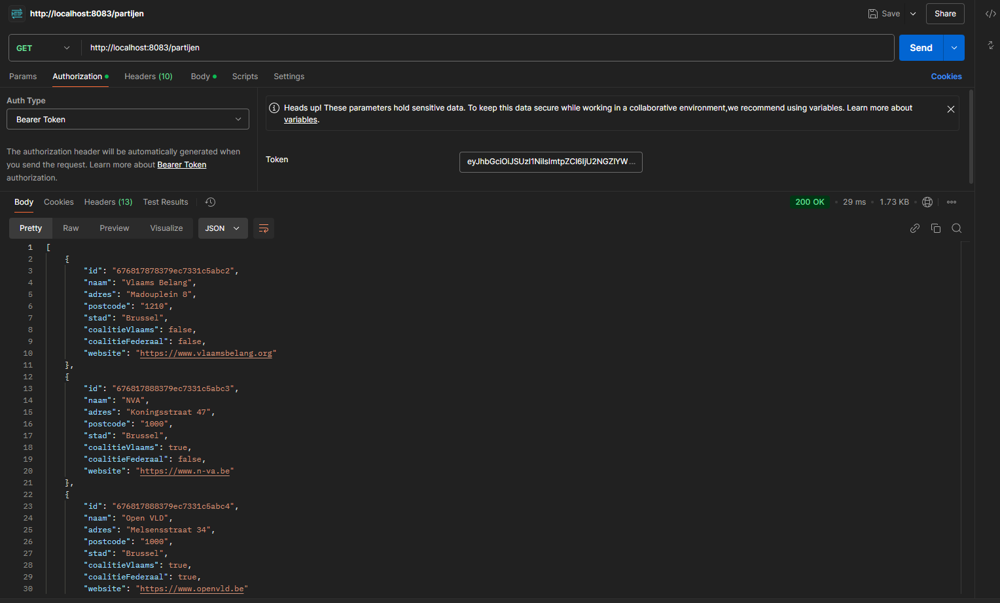
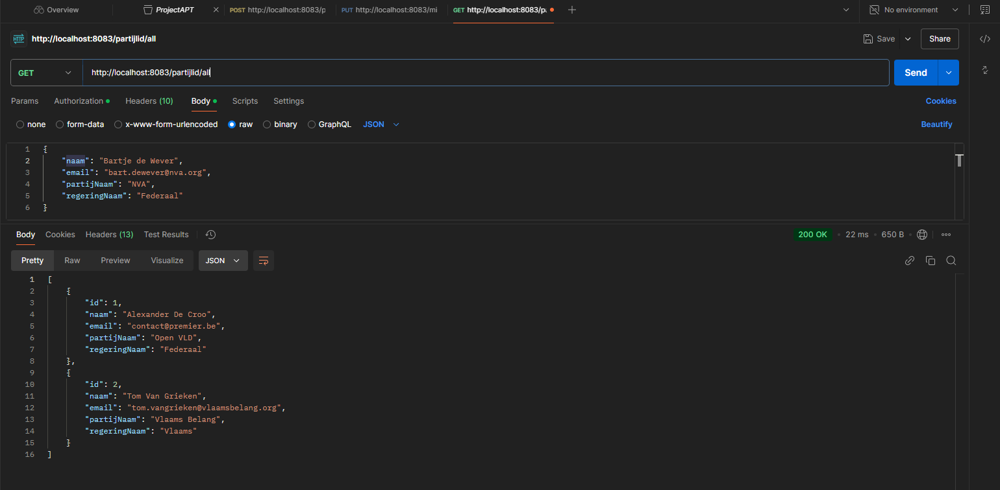

# APTProject - Belgische Regering 2020-2024

Wij hebben voor onze opdracht een applicatie ontwikkeld voor de Belgische Regering van 2020-2024. Onze applicatie heeft 4 micro-services geïmplementeerd die de nodige functionaliteiten aanbied. In onze applicatie kunnen de verschillende partijen, regeringen, ministers en ook natuurlijk alle leden worden gemanaged. Elke micro-service bied de benodigde functionaliteiten aan om alles succesvol te laten verlopen. Alles loopt dan via een API-Gateway die alle routing handelt. Iedere persoon kan op onze applicatie komen om alles te bekijken, maar enkel de admins kunnen de data aanpassen. Wij maken gebruik van 0Auth beveliging om de data veilig en integer te houden.

IMG van de Microservice

## CheckList:
- 4 Microservices✅
- CI/CD Deployment
- Docker Compose Deployment✅
- Beveiliging✅
- Unit Testing✅

## Extra's:
- Front-End✅

## Microservices:
- API-Gateway : 8300 (Handeled alle routing naar de andere services)
- Partijlid-Service : 8081 (De hoofd-service, heeft alle personen die in deze applicatie voorkomen)
- Partij-Service : 8082 (Een service met alle verschillende partijen)
- Regering-Service : 8080 (Een service met alle verschillende regeringen)
- Minister-Service : 8084 (Een service met verschillende ministers)

- Front End : 4200

## API Endpoints
Partijlid
- "/all": geeft alle personenen
- "/{id}": geeft de persoon met een specifieke id
- "/naam/{naam}": geeft de persson met een specifieke naam
- "/create": maakt een nieuwe persoon aan
- "/{id}/edit": bewerkt de data van een bepaalde id
- "/{id}/delete": verwijderd een bepaalde id

Partijen
- "/alle-partijen": geeft alle partijen
- "/partij/{naam}: geeft de partij met een bepaalde naam

Regeringen
- "/alle-regeringen": geeft alle regeringen
- "/regering/{naam}": geeft de regering met een bepaalde naam

Ministers
- "/all": geeft alle ministers
- "/{id}": geeft de minister met een specifieke id
- "/naam/{naam}": geeft de minister met een specifieke naam
- "/create": maakt een nieuwe minister aan
- "/{id}/edit": bewerkt de data van een bepaalde id
- "/{id}/delete": verwijderd een bepaalde id

## POSTMAN Endpoints
Algemene endpoints
- alle partijen

- alle leden

- lid met specifieke id

- lid met een specifieke naam

- create

- edit

- delete

- unauthorized

